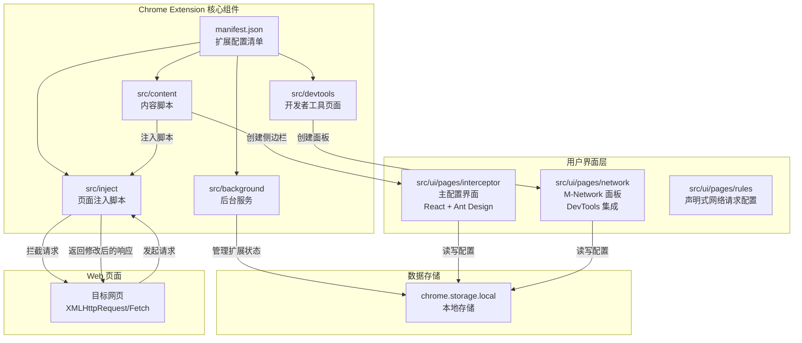
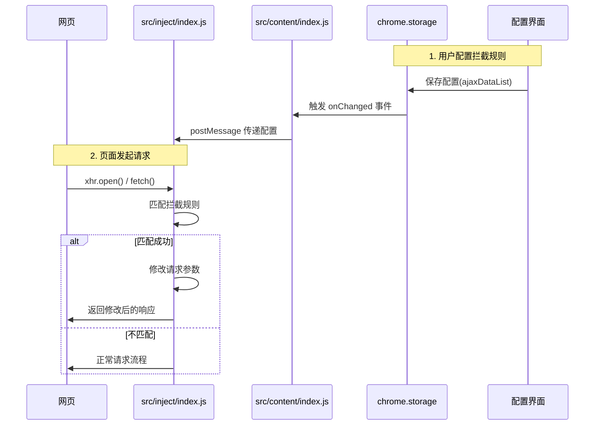

# MockNetwork 项目架构深度解析

## 📋 项目概述

**MockNetwork** 是一个功能强大的 Chrome 扩展插件,用于拦截和修改 XMLHttpRequest 和 Fetch 请求的响应结果。

### 核心能力

- ✅ 拦截并修改 XMLHttpRequest 和 Fetch 请求响应(包括 404 状态)
- ✅ 支持正则表达式和 HTTP 方法匹配
- ✅ 支持 JSON/JavaScript 格式编辑响应(支持 Mock.js 语法)
- ✅ 修改请求 URL、Headers、Payload
- ✅ DevTools 中的 M-Network 面板
- ✅ 支持 declarativeNetRequest API

---

## 🏗️ 整体架构

### 架构图



---

## 🔧 核心组件详解

### 1. **manifest.json** - 扩展配置清单

定义了扩展的基本信息、权限和资源配置。

**关键配置:**

- `manifest_version: 3` - 使用最新的 Manifest V3
- `permissions` - 存储、网络请求拦截权限
- `host_permissions` - 所有 HTTP/HTTPS 站点访问权限
- `content_scripts` - 在所有页面注入 `src/content/index.js`
- `devtools_page` - 注册 DevTools 扩展页面
- `web_accessible_resources` - 允许页面访问的资源

### 2. **src/background/index.js** - 后台服务

**职责:**

- 🎯 管理扩展图标的 Badge 状态(ON/OFF)
- 🎯 处理扩展图标点击事件,切换侧边栏显示/隐藏
- 🎯 监听 `chrome.storage` 变化,同步 UI 状态

### 3. **src/content/index.js** - 内容脚本

这是整个架构的**核心枢纽**,负责连接各个组件。

**核心职责:**

#### 3.1 脚本注入

```javascript
injectedScript('src/inject/index.js'); // 注入拦截脚本
injectedScript('src/inject/mock.js'); // 注入 Mock.js
```

#### 3.2 创建侧边栏 UI

- 动态创建 iframe 容器,加载配置界面
- 提供操作按钮:关闭、缩放、画中画、主题切换等
- 实现侧边栏的显示/隐藏动画

#### 3.3 数据同步

- 从 `chrome.storage.local` 读取配置
- 通过 `postMessage` 将配置传递给 `src/inject/index.js`
- 监听 storage 变化,实时更新拦截规则

### 4. **src/inject/index.js** - 页面注入脚本(拦截核心)

这是**请求拦截的核心实现**,运行在页面上下文中。

#### 4.1 拦截机制

**XMLHttpRequest 拦截:**

```javascript
ajax_tools_space.myXHR = function() {
  const xhr = new ajax_tools_space.originalXHR;

  this.open = (...args) => {
    this._matchedInterface = getMatchedInterface({...});
  }

  xhr.onreadystatechange = (...args) => {
    if (this.readyState === this.DONE) {
      modifyResponse();
    }
  }
}

window.XMLHttpRequest = ajax_tools_space.myXHR;
```

**Fetch 拦截:**

```javascript
ajax_tools_space.myFetch = function(...args) {
  const matchedInterface = getMatchedInterface({...});

  return ajax_tools_space.originalFetch(...args).then(async (response) => {
    const overrideText = getOverrideText(...);
    return new Response(stream, {...});
  });
}

window.fetch = ajax_tools_space.myFetch;
```

### 5. **src/ui/pages/interceptor** - 主配置界面

基于 **React + TypeScript + Ant Design** 构建的配置管理界面。

#### 核心组件

- **App.tsx** - 主应用组件,管理拦截规则分组
- **InterceptorPanel.tsx** - 拦截规则列表面板
- **ModifyDataModal.tsx** - 数据编辑弹窗,集成 Monaco Editor

### 6. **src/ui/pages/network** - M-Network 面板

集成到 Chrome DevTools 的网络监控面板。

**核心功能:**

- 网络请求记录
- 快速添加拦截规则
- 请求详情查看

### 7. **src/devtools** - DevTools 扩展

```javascript
chrome.devtools.panels.create(
  'M-Network',
  'icon.png',
  '../src/ui/dist/network.html',
  function (panel) {
    console.log('M-Network 面板创建成功！');
  },
);
```

---

## 🔄 数据流分析

### 请求拦截流程



---

## 🛠️ 技术栈

### 前端框架

- **React 18** - UI 框架
- **TypeScript** - 类型安全
- **Ant Design 4** - UI 组件库
- **Monaco Editor** - 代码编辑器
- **Vite 2** - 构建工具

### Chrome Extension API

- **Manifest V3** - 最新扩展规范
- **chrome.storage** - 数据持久化
- **chrome.runtime** - 消息通信
- **chrome.tabs** - 标签页管理
- **chrome.devtools** - DevTools 集成
- **chrome.declarativeNetRequest** - 声明式网络请求

### 其他库

- **Mock.js** - 随机数据生成

---

## 📂 项目结构

```
ajax-tools/
├── manifest.json              # 扩展配置清单
├── assets/                    # 静态资源
└── src/                       # 源码目录
    ├── background/            # 后台服务
    │   └── index.js           # 后台服务 Worker
    ├── content/               # 内容脚本
    │   └── index.js           # 核心枢纽脚本
    ├── inject/                # 页面注入脚本
    │   ├── index.js           # 拦截实现
    │   └── mock.js            # Mock.js 库
    ├── devtools/              # DevTools 扩展
    │   ├── index.html         # DevTools 页面
    │   └── index.js           # 创建 M-Network 面板
    └── ui/                    # React UI 应用
        ├── pages/             # 页面模块
        │   ├── interceptor/   # 拦截器配置界面
        │   │   ├── App.tsx    # 主应用组件
        │   │   ├── InterceptorPanel.tsx  # 规则列表
        │   │   └── ModifyDataModal.tsx   # 编辑弹窗
        │   ├── network/       # M-Network 面板
        │   │   ├── App.tsx    # 网络监控组件
        │   │   └── RequestDrawer.tsx     # 请求详情
        │   └── rules/         # 声明式规则配置
        ├── components/        # 公共组件
        │   └── MonacoEditor/  # 代码编辑器
        ├── hooks/             # 自定义 hooks
        │   └── useTheme.ts    # 主题 hook
        ├── utils/             # 工具函数
        │   └── index.tsx      # 通用工具
        ├── constants/         # 常量/默认值
        │   └── index.ts       # 配置常量
        ├── index.html         # 拦截器入口
        ├── network.html       # 网络面板入口
        ├── rules.html         # 规则配置入口
        ├── vite.config.js     # Vite 配置
        └── package.json       # 依赖配置
```

---

## 📊 拦截器分组机制

### 分组数据结构

```typescript
interface AjaxDataListObject {
  summaryText: string; // 分组名称
  collapseActiveKeys: string[]; // 展开的项
  headerClass: string; // 颜色主题
  interfaceList: DefaultInterfaceObject[]; // 接口列表
}
```

### 优先级规则

1. **扁平化合并** - 所有分组的规则按分组顺序合并
2. **先到先得** - 使用 `Array.find()` 返回第一个匹配的规则
3. **优先级顺序** - 分组顺序 → 组内规则顺序

### 三种匹配类型

| 类型        | 说明                 | 示例                                    |
| ----------- | -------------------- | --------------------------------------- |
| **Normal**  | URL 包含指定字符串   | `api/user` 匹配 `/api/user/info`        |
| **Regex**   | URL 匹配正则表达式   | `/api\/user\/\d+/` 匹配 `/api/user/123` |
| **Payload** | 请求体 JSON key 匹配 | `userId` 匹配 `{"userId": 1}`           |

---

## 📝 总结

MockNetwork 展示了一个**完整的 Chrome Extension 架构**:

1. ✨ **优雅的拦截机制** - 通过代理模式无侵入式拦截请求
2. ✨ **清晰的分层架构** - 后台/内容/页面脚本职责分明
3. ✨ **强大的配置管理** - React + Ant Design 提供友好的 UI
4. ✨ **DevTools 集成** - 提供专业的网络监控面板
5. ✨ **灵活的扩展性** - 支持 Mock.js、正则匹配、多种配置方式
