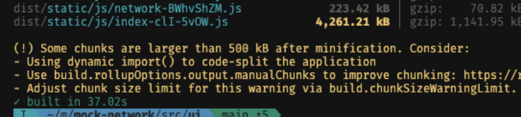
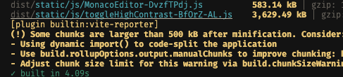

# Rolldown 迁移总结

本文档记录了将项目从标准 Vite 迁移到 Rolldown 驱动的 `rolldown-vite` 的过程和性能提升效果。

## 性能提升结果

### 构建时间对比

| 打包工具 | 构建时间 | 性能提升 |
|---------|---------|---------|
| Vite (Rollup) | 37.02s | - |
| Rolldown | 4.09s | **↑ 89%** |

从 **37.02 秒**降至 **4.09 秒**，构建速度提升了约 **9 倍**！

### 性能对比截图

<table>
<tr>
<td width="50%">
  
  <p align="center"><b>Vite (Rollup)</b> - 构建时间：37.02s</p>
</td>
<td width="50%">
  
  <p align="center"><b>Rolldown</b> - 构建时间：4.09s</p>
</td>
</tr>
</table>

---

## 实施的变更

### 1. package.json

添加了 pnpm overrides 配置，使项目使用 `rolldown-vite` 替代标准 `vite`：

```json
{
  "pnpm": {
    "overrides": {
      "vite": "npm:rolldown-vite@latest"
    }
  }
}
```

### 2. vite.config.js

清理了重复的配置，移除了不必要的 `rolldownOptions` 块（12 行代码）。使用 rolldown-vite 后，原有的 `rollupOptions` 会被自动处理，无需额外配置。

---

## 关于 Rolldown

### Rolldown 是什么？

Rolldown 是一个现代化、高性能的 JavaScript 打包工具，由 Rust 编写。它被设计为 Rollup 的替代品，旨在保持与现有生态系统兼容的同时，显著提升性能。

### 为什么选择 Rolldown？

1. **速度** - 利用 Rust 的高性能进行构建
2. **兼容性** - 能够与现有的 Rollup 插件一起工作
3. **优化** - 拥有比 esbuild 和 Rollup 更先进的特性
4. **统一工具链** - 将开发和生产构建统一到一个高性能的打包工具中

---

## 参考资源

- [Rolldown 官方文档](https://rolldown.rs/guide/getting-started)
- [Vite Rolldown 集成指南](https://cn.vite.dev/guide/rolldown)
- [Rolldown 已知限制](https://cn.vite.dev/guide/rolldown#known-limitations)

---

## 注意事项

> **重要提示**  
> `rolldown-vite` 目前是实验性功能。虽然大部分场景下工作良好，但如果遇到问题，可以随时移除 `pnpm.overrides` 配置回退到标准 Vite。

---

**迁移日期**：2026-02-05  
**性能提升**：89% (37.02s → 4.09s)
